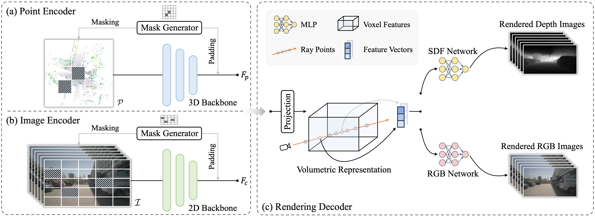

<div align='center'>

<h2><a href="https://arxiv.org/abs/2310.08370">UniPAD: A Universal Pre-training Paradigm for Autonomous Driving</a></h2>

Honghui Yang<sup>1,2</sup>, Sha Zhang<sup>1,4</sup>, Di Huang<sup>1,5</sup>, Xiaoyang Wu<sup>1,3</sup>, Haoyi Zhu<sup>1,4</sup>, Tong He<sup>1*</sup>,
<br>
Shixiang Tang<sup>1</sup>, Hengshuang Zhao<sup>3</sup>, Qibo Qiu<sup>6</sup>, Binbin Lin<sup>2*</sup>, Xiaofei He<sup>2</sup>, Wanli Ouyang<sup>1</sup>
 
<sup>1</sup>Shanghai AI Lab, <sup>2</sup>ZJU, <sup>3</sup>HKU, <sup>4</sup>USTC, <sup>5</sup>USYD, <sup>6</sup>Zhejiang Lab
 

</div>


<p align="center">
    
</p>

<!-- In contrast to numerous NLP and 2D computer vision foundational models, the learning of a robust and highly generalized 3D foundational model poses considerably greater challenges. This is primarily due to the inherent data variability and the diversity of downstream tasks. In this paper, we introduce a comprehensive 3D pre-training framework designed to facilitate the acquisition of efficient 3D representations, thereby establishing a pathway to 3D foundational models. Motivated by the fact that informative 3D features should be able to encode rich geometry and appearance cues that can be utilized to render realistic images, we propose a novel universal paradigm to learn point cloud representations by differentiable neural rendering, serving as a bridge between 3D and 2D worlds. We train a point cloud encoder within a devised volumetric neural renderer by comparing the rendered images with the real images. Notably, our approach demonstrates the seamless integration of the learned 3D encoder into diverse downstream tasks. These tasks encompass not only high-level challenges such as 3D detection and segmentation but also low-level objectives like 3D reconstruction and image synthesis, spanning both indoor and outdoor scenarios. Besides, we also illustrate the capability of pre-training a 2D backbone using the proposed universal methodology, surpassing conventional pre-training methods by a large margin. For the first time, PonderV2 achieves state-of-the-art performance on 11 indoor and outdoor benchmarks. The consistent improvements in various settings imply the effectiveness of the proposed method. -->

In this paper, we present UniPAD, a novel self-supervised learning paradigm applying 3D volumetric differentiable rendering. UniPAD implicitly encodes 3D space, facilitating the reconstruction of continuous 3D shape structures and the intricate appearance characteristics of their 2D projections. The flexibility of our method enables seamless integration into both 2D and 3D frameworks, enabling a more holistic comprehension of the scenes.


## News
[2023-11-30] The code is released.

[2023-10-12] The paper is publicly available on ArXiv.

## Installation
This project is based on MMDetection3D, which can be constructed as follows.

- Install PyTorch [v1.7.1](https://pytorch.org/get-started/previous-versions/) and mmDetection3D [v0.17.3](https://github.com/open-mmlab/mmdetection3d/tree/v0.17.3) following the [instructions](https://github.com/open-mmlab/mmdetection3d/blob/v0.17.3/docs/getting_started.md).
- Install the required environment

```
pip install --no-index torch-scatter -f https://data.pyg.org/whl/torch-1.7.1+cu110.html
pip install mmcv-full==1.3.8 -f https://download.openmmlab.com/mmcv/dist/cu110/torch1.7.1/index.html
pip install mmdet==2.14.0 mmsegmentation==0.14.1 tifffile-2021.11.2 numpy==1.19.5 protobuf==3.19.4 scikit-image==0.19.2 pycocotools==2.0.0 waymo-open-dataset-tf-2-2-0 nuscenes-devkit==1.0.5 spconv-cu111 gpustat numba scipy pandas matplotlib Cython shapely loguru tqdm future fire yacs jupyterlab scikit-image pybind11 tensorboardX tensorboard easydict pyyaml open3d addict pyquaternion awscli timm typing-extensions==4.7.1

python setup.py develop --user
```
## Data Preparation
Please follow the instruction of [UVTR](https://github.com/dvlab-research/UVTR) to prepare the dataset.

## Training
You can train the model following the instructions. You can also find the pretrained models [here](https://drive.google.com/drive/folders/1_D57qpLDbNAEAEqfjdNFDrlB5ntSDVrT?usp=sharing).
```
bash ./extra_tools/dist_train_ssl.sh
```

## Citation
```bib
@misc{yang2023unipad,
      title={UniPAD: A Universal Pre-training Paradigm for Autonomous Driving}, 
      author={Honghui Yang and Sha Zhang and Di Huang and Xiaoyang Wu and Haoyi Zhu and Tong He and Shixiang Tang and Hengshuang Zhao and Qibo Qiu and Binbin Lin and Xiaofei He and Wanli Ouyang},
      year={2023},
      eprint={2310.08370},
      archivePrefix={arXiv},
      primaryClass={cs.CV}
}

@misc{zhu2023ponderv2,
      title={PonderV2: Pave the Way for 3D Foundation Model with A Universal Pre-training Paradigm}, 
      author={Haoyi Zhu and Honghui Yang and Xiaoyang Wu and Di Huang and Sha Zhang and Xianglong He and Tong He and Hengshuang Zhao and Chunhua Shen and Yu Qiao and Wanli Ouyang},
      year={2023},
      eprint={2310.08586},
      archivePrefix={arXiv},
      primaryClass={cs.CV}
}

@inproceedings{huang2023ponder,
  title={Ponder: Point cloud pre-training via neural rendering},
  author={Huang, Di and Peng, Sida and He, Tong and Yang, Honghui and Zhou, Xiaowei and Ouyang, Wanli},
  booktitle={Proceedings of the IEEE/CVF International Conference on Computer Vision},
  pages={16089--16098},
  year={2023}
}
```

## Acknowledgement
This project is mainly based on the following codebases. Thanks for their great works!

- [SDFStudio](https://github.com/autonomousvision/sdfstudio)
- [MMDetection3D](https://github.com/open-mmlab/mmdetection3d)
